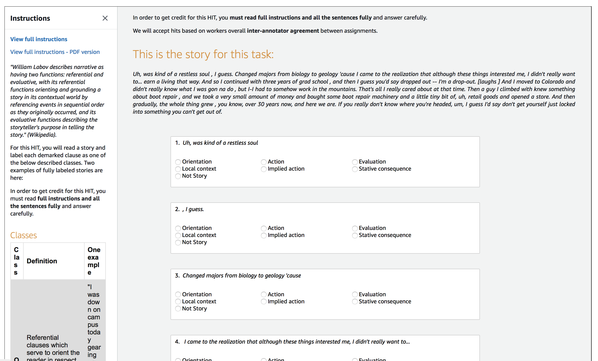

# Personal narratives @ ACL NUSE

This repo contains supplementary material for the paper "[Exploring aspects of similarity between spoken personal narratives by disentangling them into narrative clause types](https://arxiv.org/pdf/2005.12762.pdf)", in proceedings of the [2020 ACL NUSE Workshop](https://www.aclweb.org/portal/content/1st-joint-workshop-narrative-understanding-storylines-and-events-nuse-acl-2020).

> Saldias, B., & Roy, D. (July, 2020) Exploring aspects of similarity between spoken personal narratives by disentangling them into narrative clause types. *Proceedings of the 2020 ACL Workshop on Narrative Understanding, Storylines, and Events* (NUSE). ACL.

## RTN dataset

We introduce the largest dataset of annotated spoken personal narratives to our knowledge, from now on referenced as Roadtrip Nation or RTN corpus. These narratives were obtained from transcripts of **stories video-recorded by Roadtrip Nation (RTN) -- see figure 1**. In those videos, people from many backgrounds share stories about their lives and career pathways.

* **The corpus comprises 10,296 narrative clauses from 594 stories** (each one told by a different person), which account for more than **10 hours of people telling stories**, each one averaging 17.1 clauses or 62 seconds long, where each clause has on average 11 tokens. You can find it here: [data/Saldias&Roy-RTN_data.csv](data/Saldias&Roy-RTN_data.csv)

* You can find audible stories by exploring `Highlight` videos in the <a href="https://roadtripnation.com/explore/all?view=grid&sort=alpha" target="_blank">Roadtrip Nation stories' explorer</a>.

<p align="center">
    
</p>
<p align="center">
    Figure 0:
    <a href="https://roadtripnation.com/explore/all?view=grid&sort=alpha" target="_blank">
       Roadtrip Nation stories' explorer</a>.
</p>

* We followed the annotation guidelines, for Labov’s sociolinguistic model of personal narratives (Labov et al., 1967), constructed by trained researchers in Swanson et al. (2014) to explain to Mechanical Turkers how to annotate our clauses.

<p align="center">
    
</p>
<p align="center">
        Figure 1: A fragment of a personal narrative in the RTN corpus annotated by Turkers using Labov’s model.
</p>


## Annotation tasks

Find the Mechanical Turk requester HTML template for the three tasks described in the paper here:
1. [RTN corpus annotation under Labov's framework](https://htmlpreview.github.io/?https://raw.githubusercontent.com/social-machines/acl-nuse-personal-narratives/master/html/00-clause_type_annotation_task.html)
1. [Which one of the stories below is the most similar to the main story?](https://htmlpreview.github.io/?https://raw.githubusercontent.com/social-machines/acl-nuse-personal-narratives/master/html/01-matching_stories_task.html)
1. [In what aspects are the following personal narratives similar?](https://htmlpreview.github.io/?https://raw.githubusercontent.com/social-machines/acl-nuse-personal-narratives/master/html/02-asking_for_aspescts_task.html)

MTurk Task 1            |  Mturk Task 2
:-------------------------:|:-------------------------:
  |  


## Citation

If you use content in this repo, please consider citing us as below:

```
@inproceedings{saldias-roy-2020-exploring,
    title = "Exploring aspects of similarity between spoken personal narratives by disentangling them into narrative clause types",
    author = "Saldias, Belen  and
      Roy, Deb",
    booktitle = "Proceedings of the First Joint Workshop on Narrative Understanding, Storylines, and Events",
    month = jul,
    year = "2020",
    address = "Online",
    publisher = "Association for Computational Linguistics",
    url = "https://www.aclweb.org/anthology/2020.nuse-1.10",
    pages = "78--86",
    }
```


## Acknowledgments

The authors would like to thank [Roadtrip Nation](https://roadtripnation.com) for collecting and sharing their data. We also thank Swanson et al. (2014) who shared their corpus with us, and the anonymous reviewers who provided valuable feedback. We were inspired by researchers at the [Laboratory for Social Machines (LSM) at MIT](https://www.media.mit.edu/groups/social-machines/overview/) who are passionate about storytelling. This project was funded by LSM Member companies [McKinsey & Company](https://www.mckinsey.com) and [Twitter](https://twitter.com).
